Analysis Report–Walmart Sales Prediction
================
Sayorn Chin
07/30/2021

### Objective

##### The objective of this project is to develop a statistical model based on historical sales data. First, I use all 45 Walmart stores to derive some statistical values. Second, I use Store \#1 to build statistical models in order to predict weekly sales. Lastly, I perform model selection and evaluation by incorporating different evaluation metrics.

### Required R libraries

``` r
load_libraries <- function(){
  library(openair)
  library(caret)
  library(ggplot2)
  library(lubridate)
  library(dplyr)
  library(tidyverse)
  library(tidyselect)
  library(vctrs)
  library(scales)
  library(zoo)
  library(forecast)
  library(Hmisc)
  library(corrplot)
  library(PerformanceAnalytics)
  library(ggfortify)
  library(car)
  library(patchwork)
  library(knitr)
  print("The libraries have been loaded .")
}
load_libraries()
```

    ## [1] "The libraries have been loaded ."

### 1. Data preprocessing

``` r
# ++++++++++++++++++++++++++++
# DSet working directory
# ++++++++++++++++++++++++++++
setwd("/Users/schinlfc/data-science-R/retail-analysis-walmart/data")

# ++++++++++++++++++++++++++++
# Read csv file and assigned as df
# ++++++++++++++++++++++++++++
df <- read.csv("Walmart_Store_sales.csv")
# Get a summary of the data
summary(df)
```

    ##      Store        Date            Weekly_Sales      Holiday_Flag    
    ##  Min.   : 1   Length:6435        Min.   : 209986   Min.   :0.00000  
    ##  1st Qu.:12   Class :character   1st Qu.: 553350   1st Qu.:0.00000  
    ##  Median :23   Mode  :character   Median : 960746   Median :0.00000  
    ##  Mean   :23                      Mean   :1046965   Mean   :0.06993  
    ##  3rd Qu.:34                      3rd Qu.:1420159   3rd Qu.:0.00000  
    ##  Max.   :45                      Max.   :3818686   Max.   :1.00000  
    ##   Temperature       Fuel_Price         CPI         Unemployment   
    ##  Min.   : -2.06   Min.   :2.472   Min.   :126.1   Min.   : 3.879  
    ##  1st Qu.: 47.46   1st Qu.:2.933   1st Qu.:131.7   1st Qu.: 6.891  
    ##  Median : 62.67   Median :3.445   Median :182.6   Median : 7.874  
    ##  Mean   : 60.66   Mean   :3.359   Mean   :171.6   Mean   : 7.999  
    ##  3rd Qu.: 74.94   3rd Qu.:3.735   3rd Qu.:212.7   3rd Qu.: 8.622  
    ##  Max.   :100.14   Max.   :4.468   Max.   :227.2   Max.   :14.313

``` r
# Check for missing values
sum(!complete.cases(df))
```

    ## [1] 0

``` r
# Rename columns
df <- 
  df %>% 
  rename(
    store = Store,
    date = Date,
    weekly_sales = Weekly_Sales,
    holiday_flag = Holiday_Flag,
    temperature = Temperature,
    fuel_price = Fuel_Price,
    cpi = CPI,
    unemployment = Unemployment)
# Convert date to d-m-Y
df$date=as.Date(df$date,format="%d-%m-%Y")
```

### 2. Basic statistical results

``` r
## Which store has maximum sales?
df %>% 
  group_by(store) %>% summarise(weekly_sales =
  max(weekly_sales)) %>% arrange(desc(weekly_sales)) %>% head(1)
```

    ## # A tibble: 1 x 2
    ##   store weekly_sales
    ##   <int>        <dbl>
    ## 1    14     3818686.

We can see that Store \#14 has the largest weekly sales.

``` r
## Which store has maximum standard deviation?
df %>% 
  group_by(store) %>% summarise(weekly_sales = sd(weekly_sales)) %>%
  arrange(desc(weekly_sales)) %>% head(1)
```

    ## # A tibble: 1 x 2
    ##   store weekly_sales
    ##   <int>        <dbl>
    ## 1    14      317570.

We can see that Store \#14 has the largest standard deviation.

``` r
## Which store/s has good quarterly growth rate in the third quarter of 2012
# Defining the start and end date of Q3
Q3 <- 
  selectByDate( 
    df,
    start = "2012-07-01",
    end = "2012-09-30")
# Defining the start and end date of Q3
Q2 <- 
  selectByDate( 
    df,
    start = "2012-04-01",
    end = "2012-06-30")
# Finding the total weekly sales of each store in Q3
Q3_weekly_sale <- 
  data.frame(Q3 %>% group_by(store) %>% 
  summarise(Q3_weekly_sales = sum(weekly_sales)))
# Finding the total weekly sales of each store in Q2
Q2_weekly_sale <- 
  data.frame(Q2 %>% group_by(store) %>% 
  summarise(Q2_weekly_sale = sum(weekly_sales)))
# Merging Q3 and Q2 data frame on store as a common column
Q3_Q2_merged <- 
  merge(Q3_weekly_sale,Q2_weekly_sale, by="store")
# Calculating growth rate in the third quarter of 2012
Q3_Q2_merged$growth_rate <-
  (((Q3_Q2_merged$Q3_weekly_sales)-(Q2_weekly_sale$Q2_weekly_sale))
   / (Q2_weekly_sale$Q2_weekly_sale)) * 100
# Round the growth rate to two decimal places
Q3_Q2_merged$growth_rate <- 
  round(Q3_Q2_merged$growth_rate, digits = 2)
# Get stores that have good quarterly growth rate in the third quarter of 2012
Q3_Q2_merged %>% 
  group_by(store) %>% arrange(desc(growth_rate)) %>% head(20)
```

    ## # A tibble: 20 x 4
    ## # Groups:   store [20]
    ##    store Q3_weekly_sales Q2_weekly_sale growth_rate
    ##    <int>           <dbl>          <dbl>       <dbl>
    ##  1     7        8262787.       7290859.       13.3 
    ##  2    16        7121542.       6564336.        8.49
    ##  3    35       11322421.      10838313         4.47
    ##  4    26       13675692.      13155336.        3.96
    ##  5    39       20715116.      20214128.        2.48
    ##  6    41       18093844.      17659943.        2.46
    ##  7    44        4411251.       4306406.        2.43
    ##  8    24       17976378.      17684219.        1.65
    ##  9    40       12873195.      12727738.        1.14
    ## 10    23       18641489.      18488883.        0.83
    ## 11    38        5605482.       5637919.       -0.58
    ## 12    32       15396529.      15489271.       -0.6 
    ## 13    19       18203555.      18367300.       -0.89
    ## 14    17       12459453.      12592401.       -1.06
    ## 15    37        6728068.       6824549.       -1.41
    ## 16     8       11748953.      11919631.       -1.43
    ## 17    11       17516081.      17787372.       -1.53
    ## 18    27       22307711.      22744013.       -1.92
    ## 19    43        8000572.       8168836.       -2.06
    ## 20    13       26421259.      27009207.       -2.18

The table shows that only 10 stores have good quarterly growth rate in
the third quarter of 2012.

``` r
## Some holidays have a negative impact on sales. Find out holidays which have higher sales than the mean sales in non-holiday season for all stores together
# Weekly sales between nonholidays and holidays
df %>% group_by(holiday_flag) %>%
  summarise(mean_sales_of_nonholiday_and_holiday = 
  mean(weekly_sales)) # Create dummy variable for the dates of Super Bowl
```

    ## # A tibble: 2 x 2
    ##   holiday_flag mean_sales_of_nonholiday_and_holiday
    ##          <int>                                <dbl>
    ## 1            0                             1041256.
    ## 2            1                             1122888.

``` r
df$super_bowl <- 
  ifelse(df$date == "2010-02-12" | df$date == "2011-02-11" | 
  df$date == "2012-02-10" | df$date == "2013-02-08", 1, 0)
# Create dummy variable for the dates of Labour Day
df$labour_day <- 
  ifelse(df$date == "2010-09-10" | df$date == "2011-09-09" | 
  df$date == "2012-09-07" | df$date == "2013-09-06", 1, 0)
# Create dummy variable for the dates of Thanksgiving
df$thanksgiving <- 
  ifelse(df$date == "2010-11-26" | df$date == "2011-11-25" | 
  df$date == "2012-11-23" | df$date == "2013-11-29", 1, 0)
# Create dummy variable for the dates of Christmas
df$christmas <- 
  ifelse(df$date == "2010-12-31" | df$date == "2011-12-30" | 
  df$date == "2012-12-28" | df$date == "2013-12-27", 1, 0)
# Mean weekly sales during Super Bowl
df %>% 
  group_by(super_bowl) %>% summarise(super_bowl_mean_sales = 
  mean(weekly_sales)) 
```

    ## # A tibble: 2 x 2
    ##   super_bowl super_bowl_mean_sales
    ##        <dbl>                 <dbl>
    ## 1          0              1046276.
    ## 2          1              1079128.

``` r
# Mean weekly sales during Labour Day
df %>% 
  group_by(labour_day) %>% summarise(labour_day_mean_sales = 
  mean(weekly_sales)) 
```

    ## # A tibble: 2 x 2
    ##   labour_day labour_day_mean_sales
    ##        <dbl>                 <dbl>
    ## 1          0              1047062.
    ## 2          1              1042427.

``` r
# Mean weekly sales during Thanksgiving
df %>% 
  group_by(thanksgiving) %>% summarise(thanksgiving_mean_sales = 
  mean(weekly_sales)) 
```

    ## # A tibble: 2 x 2
    ##   thanksgiving thanksgiving_mean_sales
    ##          <dbl>                   <dbl>
    ## 1            0                1040946.
    ## 2            1                1471273.

``` r
# Mean weekly sales during Christmas
df %>% 
  group_by(christmas) %>% summarise(christmas_mean_sales = 
  mean(weekly_sales)) 
```

    ## # A tibble: 2 x 2
    ##   christmas christmas_mean_sales
    ##       <dbl>                <dbl>
    ## 1         0             1048187.
    ## 2         1              960833.

Here, we can see that average weekly sales went up during Thanksgiving
and Super Bowl but went down during both labour day and Christmas.
Overall, sales went up during holiday season.

``` r
### Provide a monthly and semester view of sales in units and give insights
# Split date into year, month and day.
df <- 
  df %>%
  separate(date, sep="-", into = c("year", "month", "day"))

# Plotting weekly sale distribution by month
ggplot(df, aes(x = month, y = weekly_sales/10000)) + # Scale by 10000
  geom_col() +
  geom_col(fill = "#00abff") +
  theme(text = element_text(size = 10, hjust = 0.5)) +
  theme_update(plot.title = element_text(hjust = 0.5)) +
  facet_wrap(~year) +
  ggtitle("Weekly sales distribution by month for the years of 2010-2012") +
  xlab("Month") +
  ylab("Weekly Sales (in 10000)")
```

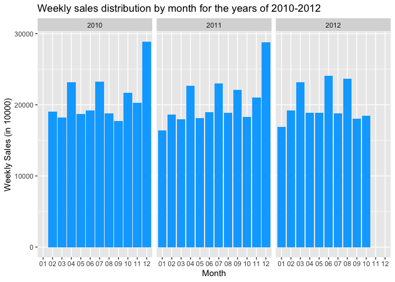<!-- -->

We can observe from the graph that highest sum of sales is recorded in
between December-2010 to December-2011.

``` r
# Create a date column
df <-
  df %>%
  mutate(date = make_date(year, month, day))

# Plotting weekly sale distribution by semester
ggplot(df, aes(x = semester(date, with_year = TRUE), y = weekly_sales/100000)) + # Scale by 10000
  geom_col() +
  geom_col(fill = "#00abff") +
  theme(text = element_text(size = 10, hjust = 0.5)) +
  theme_update(plot.title = element_text(hjust = 0.5)) +
  ggtitle("Weekly sales distribution by semester") +
  xlab("Semester") +
  ylab("Weekly Sales (in 100000)")
```

<!-- -->

We can observe from semester sales graph that at beginning of 1st
semester of 2010 and 2nd semester of 2012 sales are lowest.

### 3. Data visualisation and statistical models

``` r
# First, I need to subset the dataset to only include Store #1 information by the following code:
df1 <- df[df$store == 1, ]
# Second, I need to split into train/test dataset and set seed for reproducible results
set.seed(123) 
sample_size <- floor(0.75 * nrow(df1))
train_index <- sample(seq_len(nrow(df1)), size = sample_size)
train <- df1[train_index, ]
test <- df1[-train_index, ]
```

#### 3.1 Data visualisation

``` r
ggplot(train, aes(x=temperature)) + 
  geom_histogram(aes(y=..density..), colour="black", fill="white") +
  geom_density(alpha=.2, fill="#FF6666") +
  ggtitle("Histogram plot of temprature") +
  xlab("Temperature") +
  ylab("Density")
```

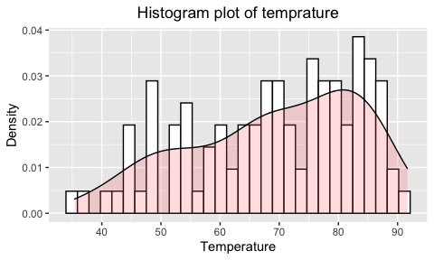<!-- -->

``` r
ggplot(train, aes(x=fuel_price)) + 
  geom_histogram(aes(y=..density..), colour="black", fill="white") +
  geom_density(alpha=.2, fill="#FF6666") +
  ggtitle("Histogram plot of fuel price") +
  xlab("Fuel Price") +
  ylab("Density")
```

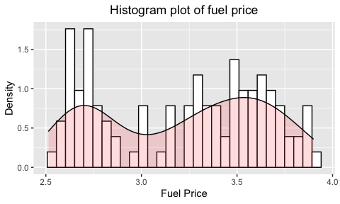<!-- -->

``` r
ggplot(train, aes(x=cpi)) + 
  geom_histogram(aes(y=..density..), colour="black", fill="white") +
  geom_density(alpha=.2, fill="#FF6666") +
  ggtitle("Histogram plot of consumer price index (CPI)") +
  xlab("CPI") +
  ylab("Density")
```

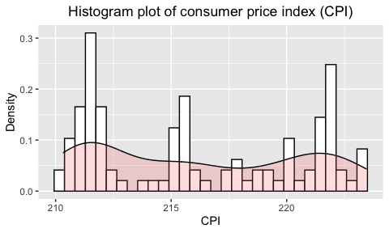<!-- -->

``` r
ggplot(train, aes(x=unemployment)) +
  geom_histogram(aes(y=..density..), colour="black", fill="white") +
  geom_density(alpha=.2, fill="#FF6666") +
  ggtitle("Histogram plot of unemployment rate") +
  xlab("Unemployment (%)") +
  ylab("Density")
```

<!-- -->

``` r
ggplot(train, aes(x=weekly_sales/1000)) +
  geom_histogram(aes(y=..density..), colour="black", fill="white") +
  geom_density(alpha=.2, fill="#FF6666") +
  ggtitle("Histogram plot of weekly sales") +
  xlab("Weekly Sales (in 1000)") +
  ylab("Density")
```

<!-- -->

``` r
ggplot(train, aes(x=log(weekly_sales))) +
  geom_histogram(aes(y=..density..), colour="black", fill="white") +
  geom_density(alpha=.2, fill="#FF6666") +
  ggtitle("Histogram plot of log weekly_sales") +
  xlab("Log Weekly Sales") +
  ylab("Density")
```

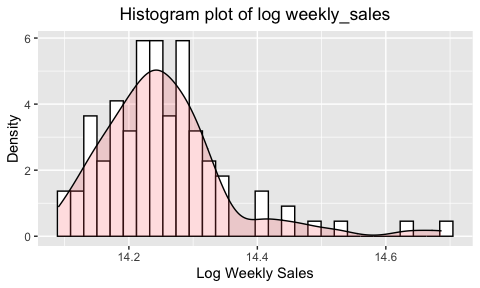<!-- -->

``` r
ggplot(train, aes(x=temperature, y=weekly_sales/1000)) +
  geom_point(shape=18, color="blue")+
  geom_smooth(method=lm,  linetype="dashed",
  color="darkred", fill="blue") +
  labs(title = "Scatter plot of temperature vs. weekly sales") +
  ylab("Weekly Sales (in 1000)") +
  xlab("Temperature")
```

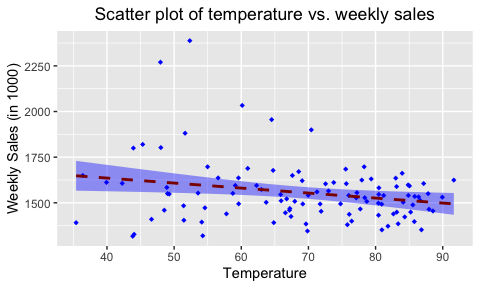<!-- -->

``` r
ggplot(train, aes(x=temperature, y=log(weekly_sales))) +
  geom_point(shape=18, color="blue")+
  geom_smooth(method=lm,  linetype="dashed",
  color="darkred", fill="blue") +
  labs(title = "Scatter plot of temperature vs. log weekly sales") +
  ylab("Log Weekly Sales") +
  xlab("Temperature")
```

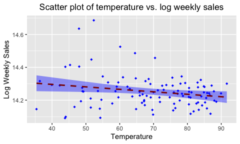<!-- -->

``` r
ggplot(train, aes(x=unemployment, y=log(weekly_sales))) + 
  geom_point(shape=18, color="blue")+
  geom_smooth(method=lm,  linetype="dashed",
              color="darkred", fill="blue") +
  labs(title = "Scatter plot of unemployment rate vs. log weekly 
  wales") +
  ylab("Log Weekly Sales") +
  xlab("Unemployment (%)")
```

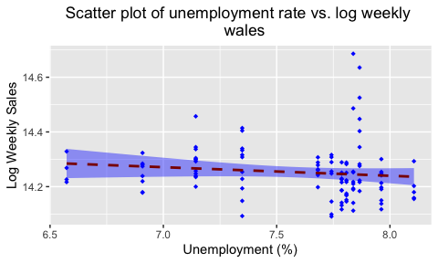<!-- -->

``` r
ggplot(train, aes(x=cpi, y=weekly_sales/1000)) + 
  geom_point(shape=18, color="blue")+
  geom_smooth(method=lm,  linetype="dashed",
  color="darkred", fill="blue") +
  labs(title = "Scatter plot of CPI vs. weekly sales") +
  ylab("Weekly Sales (in 1000)") +
  xlab("CPI")
```

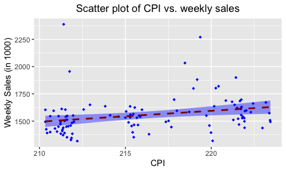<!-- -->

``` r
ggplot(train, aes(x=cpi, y=log(weekly_sales))) + 
  geom_point(shape=18, color="blue")+
  geom_smooth(method=lm,  linetype="dashed",
  color="darkred", fill="blue") +
  labs(title = "Scatter plot of CPI vs. log weekly sales") +
  ylab("Log Weekly Sales") +
  xlab("CPI")
```

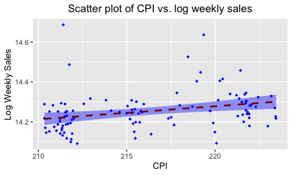<!-- -->

From the nine figures above, temperature seems to be the only one that
follows normal distribution, but it also appears to be negatively
skewed. Furthermore, there is weakly linear relationship between
temperature, fuel price, unemployment rate, consumer price index, and
that of weakly sales and log weakly sales.

#### 3.2 Linear regression

##### 3.2.1 Model I

I will star by using the lm() function to fit a linear regression model
for store \#1 with weekly\_sales as the response.

``` r
lm_fit1 <- 
  lm(weekly_sales ~ temperature + cpi + thanksgiving + 
  fuel_price + unemployment + super_bowl, data = train)
# Show results of the fitted regression
summary(lm_fit1) 
```

    ## 
    ## Call:
    ## lm(formula = weekly_sales ~ temperature + cpi + thanksgiving + 
    ##     fuel_price + unemployment + super_bowl, data = train)
    ## 
    ## Residuals:
    ##     Min      1Q  Median      3Q     Max 
    ## -303471  -77603   -4448   52793  867344 
    ## 
    ## Coefficients:
    ##              Estimate Std. Error t value Pr(>|t|)    
    ## (Intercept)  -2984601    2101330  -1.420 0.158619    
    ## temperature     -2150       1111  -1.935 0.055762 .  
    ## cpi             18007       8210   2.193 0.030606 *  
    ## thanksgiving   427099     107103   3.988 0.000127 ***
    ## fuel_price       1453      58670   0.025 0.980287    
    ## unemployment   102928      68334   1.506 0.135154    
    ## super_bowl     119793     109883   1.090 0.278251    
    ## ---
    ## Signif. codes:  0 '***' 0.001 '**' 0.01 '*' 0.05 '.' 0.1 ' ' 1
    ## 
    ## Residual standard error: 148000 on 100 degrees of freedom
    ## Multiple R-squared:  0.2794, Adjusted R-squared:  0.2362 
    ## F-statistic: 6.462 on 6 and 100 DF,  p-value: 8.781e-06

This model shows that consumer price index and Thanksgiving holiday are
positively influence weekly sales, and are significant. For example, an
increase in CPI means that a household has to spend more dollars to
maintain the same standard of living; that’s mostly bad for the
households, but it can be good for businesses like Walmar. The R-squred
and adjusted R-squared are quite low. This is due to the fact that the
training set consists of only 107 observations. Thus, only about 28% of
the variance for a weekly sales are explained by the independent
variables in the model

Next, I examine some diagnostic plots. Four diagnostic plots shown
below.

``` r
par(mfrow = c(2,2))
# Diagnostic analysis
autoplot(lm_fit1)
```

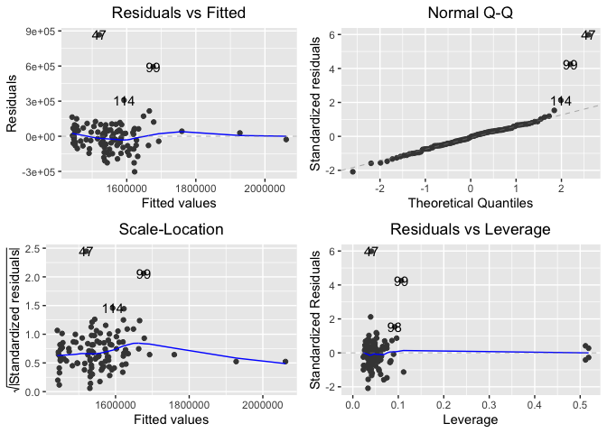<!-- -->

The Normal Q-Q plot, for example, reveals the error term is normally
distributed.

##### 3.2.2 Model II

I will perform a second fitted linear regression analysis by only
including significant right-hand side variables.

``` r
lm_fit2 <- lm(weekly_sales ~ cpi + thanksgiving, data = train)
# Show results of the fitted regression
summary(lm_fit2) 
```

    ## 
    ## Call:
    ## lm(formula = weekly_sales ~ cpi + thanksgiving, data = train)
    ## 
    ## Residuals:
    ##     Min      1Q  Median      3Q     Max 
    ## -269038  -83150   -9627   48422  890092 
    ## 
    ## Coefficients:
    ##              Estimate Std. Error t value Pr(>|t|)    
    ## (Intercept)   -708020     722538  -0.980  0.32941    
    ## cpi             10434       3342   3.123  0.00232 ** 
    ## thanksgiving   457976     108929   4.204 5.56e-05 ***
    ## ---
    ## Signif. codes:  0 '***' 0.001 '**' 0.01 '*' 0.05 '.' 0.1 ' ' 1
    ## 
    ## Residual standard error: 152500 on 104 degrees of freedom
    ## Multiple R-squared:  0.2036, Adjusted R-squared:  0.1883 
    ## F-statistic:  13.3 on 2 and 104 DF,  p-value: 7.207e-06

``` r
# Diagnostic analysis
par(mfrow = c(2,2))
autoplot(lm_fit2) 
```

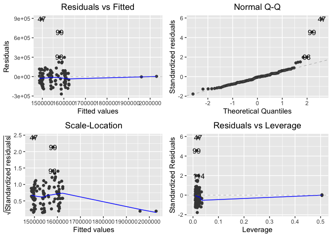<!-- -->

As shown above, the second model performs worst in terms of R-squared
and adjusted R-squared. This makes sense since each variable is
regressed against all others, and what is left unexplained (residuals)
is carried over. In a way, the regression process looks for explanations
in the variance in the data, but it doesn’t really excel at telling what
is signal and what is noise.

##### 3.2.3 Model III

I had observed in histogram plot that weekly sales is positively skewed.
Hence, I will perform log transformation on the response variable.

``` r
lm_fit3 <- lm(log(weekly_sales) ~ temperature + cpi + 
  thanksgiving + fuel_price + unemployment + 
  super_bowl,data = train)
# Show results of the fitted regression
summary(lm_fit3)
```

    ## 
    ## Call:
    ## lm(formula = log(weekly_sales) ~ temperature + cpi + thanksgiving + 
    ##     fuel_price + unemployment + super_bowl, data = train)
    ## 
    ## Residuals:
    ##      Min       1Q   Median       3Q      Max 
    ## -0.19912 -0.04631  0.00028  0.03726  0.45897 
    ## 
    ## Coefficients:
    ##                Estimate Std. Error t value Pr(>|t|)    
    ## (Intercept)  11.5359704  1.2303933   9.376 2.31e-15 ***
    ## temperature  -0.0011647  0.0006503  -1.791 0.076345 .  
    ## cpi           0.0107954  0.0048073   2.246 0.026928 *  
    ## thanksgiving  0.2491127  0.0627122   3.972 0.000134 ***
    ## fuel_price    0.0047013  0.0343528   0.137 0.891422    
    ## unemployment  0.0582004  0.0400117   1.455 0.148916    
    ## super_bowl    0.0810056  0.0643399   1.259 0.210952    
    ## ---
    ## Signif. codes:  0 '***' 0.001 '**' 0.01 '*' 0.05 '.' 0.1 ' ' 1
    ## 
    ## Residual standard error: 0.08663 on 100 degrees of freedom
    ## Multiple R-squared:  0.2879, Adjusted R-squared:  0.2452 
    ## F-statistic: 6.739 on 6 and 100 DF,  p-value: 5.121e-06

``` r
# Diagnostic analysis
par(mfrow = c(2,2))
autoplot(lm_fit3)
```

<!-- -->

This model shows that R-squared is improving from Model I to
approximately 29%, but weekly sales are only significantly inluent
consumper price index and Thanksgiving holiday.

##### 3.2.4 Model IV

Similar to Model III, I will perform log transformation on the dependent
variable, but only including signifant independent variables.

``` r
lm_fit4 <- lm(log(weekly_sales) ~ cpi + thanksgiving, data = train)
# Show results of the fitted regression
summary(lm_fit4)
```

    ## 
    ## Call:
    ## lm(formula = log(weekly_sales) ~ cpi + thanksgiving, data = train)
    ## 
    ## Residuals:
    ##      Min       1Q   Median       3Q      Max 
    ## -0.18156 -0.05025 -0.00287  0.03473  0.47086 
    ## 
    ## Coefficients:
    ##               Estimate Std. Error t value Pr(>|t|)    
    ## (Intercept)  12.774554   0.422331  30.248  < 2e-16 ***
    ## cpi           0.006814   0.001953   3.489 0.000713 ***
    ## thanksgiving  0.265379   0.063670   4.168 6.37e-05 ***
    ## ---
    ## Signif. codes:  0 '***' 0.001 '**' 0.01 '*' 0.05 '.' 0.1 ' ' 1
    ## 
    ## Residual standard error: 0.08915 on 104 degrees of freedom
    ## Multiple R-squared:  0.2158, Adjusted R-squared:  0.2007 
    ## F-statistic: 14.31 on 2 and 104 DF,  p-value: 3.237e-06

``` r
# Diagnostic analysis
par(mfrow = c(2,2))
autoplot(lm_fit4)
```

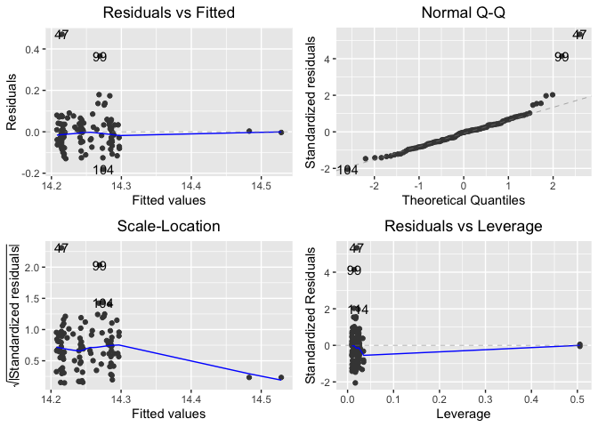<!-- -->

This model performs a little bit better than Model II in terms of
R-squared and adjusted R-squared. Furthermore, consumer price index
becomes even more signifcant and is positively associated with weekly
sales.

### 3. Model evaluation

This section performs various accuracy metrics for the four models by
using the test dataset.

#### 3.1 Evaluation of Model I

``` r
#Fit the test dataset to the training Model I
lm_fit_pred1 <- predict(lm_fit1, newdata = test, type = "response")
```

Now, taking into consideration the test data, the correlation between
actual values and predicted values can be used as a form of accuracy
measure.

##### 3.1.1 Model I correlation accuracy

``` r
# Actuals and predicteds 
act_pred1 <- data.frame(cbind(actuals=test$weekly_sales,
  predicteds=lm_fit_pred1))
# Correlation accuracy
cor(act_pred1) 
```

    ##              actuals predicteds
    ## actuals    1.0000000  0.1596404
    ## predicteds 0.1596404  1.0000000

Correlation shows a low value of approximately 16%, so it means that
actuals values and predicted values have different directional movement.

Here an overview of the first 10 rows of the new dataframe composed by
actual values and predicted values:

``` r
head(act_pred1, n=10)
```

    ##    actuals predicteds
    ## 1  1643691    1563715
    ## 2  1641957    1694267
    ## 5  1554807    1559354
    ## 11 1466058    1470829
    ## 18 1615525    1452173
    ## 19 1542561    1457714
    ## 28 1508238    1444765
    ## 33 1430379    1453011
    ## 36 1508240    1501454
    ## 45 1682614    1534537

##### 3.1.2 Model I min-max accuracy

A good metric to see how much they are close is the min-max accuracy,
that considers the average between the minimum and the maximum
prediction.

``` r
min_max1 <- 
  mean(apply(act_pred1, 1, min) / apply(act_pred1, 1, max))
# Show the result
print(min_max1) 
```

    ## [1] 0.9462576

The result of 0.9462576 is a high value, and it means that the accuracy
is very good. Note: ideally, result of 1 is for a nearly perfect
prediction.

##### 3.1.3 Model I mean absolute percentage deviation

Mean absolute percentage deviation is so defined:

``` r
mape1 <- 
  mean(abs((act_pred1$predicteds -
  act_pred1$actuals))/act_pred1$actuals)
# show the result
print(mape1) 
```

    ## [1] 0.05580002

The result of about 0.05580002 is low, and means a pretty good
prediction accuracy. Note: MAPE can only be computed with respect to
data that are guaranteed to be strictly positive.

#### 3.1 Evaluation of Model I

``` r
# Fit the test dataset to the training Model I
lm_fit_pred1 <- predict(lm_fit1, newdata = test, type = "response")
```

Now, taking into consideration the test data, the correlation between
actuals values and predicted values can be used as a form of accuracy
measure.

##### 3.1.1 Model I correlation accuracy

``` r
# Actuals and predicteds 
act_pred1 <- data.frame(cbind(actuals=test$weekly_sales,
  predicteds=lm_fit_pred1))
# Correlation accuracy
cor(act_pred1) 
```

    ##              actuals predicteds
    ## actuals    1.0000000  0.1596404
    ## predicteds 0.1596404  1.0000000

Correlation shows a low value of approximately 16%, so it means that
actuals values and predicted values have different directional movement.

Here an overview of the first 10 rows of the new dataframe composed by
actual values and predicted values:

``` r
head(act_pred1, n=10)
```

    ##    actuals predicteds
    ## 1  1643691    1563715
    ## 2  1641957    1694267
    ## 5  1554807    1559354
    ## 11 1466058    1470829
    ## 18 1615525    1452173
    ## 19 1542561    1457714
    ## 28 1508238    1444765
    ## 33 1430379    1453011
    ## 36 1508240    1501454
    ## 45 1682614    1534537

##### 3.1.2 Model I min-max accuracy

A good metric to see how much they are close is the min-max accuracy,
that considers the average between the minimum and the maximum
prediction.

``` r
min_max1 <- 
  mean(apply(act_pred1, 1, min) / apply(act_pred1, 1, max))
# Show the result
print(min_max1) 
```

    ## [1] 0.9462576

The result of 0.9462576 is a high value, and it means that the accuracy
is very good. Note: ideally, result of 1 is for a nearly perfect
prediction.

##### 3.1.3 Model I mean absolute percentage deviation

Mean absolute percentage deviation is so defined:

``` r
mape1 <- 
  mean(abs((act_pred1$predicteds -
  act_pred1$actuals))/act_pred1$actuals)
# show the result
print(mape1) 
```

    ## [1] 0.05580002

The result of about 0.05580002 is low, and means a pretty good
prediction accuracy. Note: MAPE can only be computed with respect to
data that are guaranteed to be strictly positive.

#### 3.2 Evaluation of Model II

``` r
# Fit the test dataset to the training Model II
lm_fit_pred2 <- predict(lm_fit2, newdata = test, type = "response")
```

##### 3.2.1 Model II correlation accuracy

``` r
# Actuals and predicteds 
act_pred2 <- data.frame(cbind(actuals=test$weekly_sales, predicteds=lm_fit_pred2)) 
# Correlation accuracy
cor(act_pred2) 
```

    ##               actuals predicteds
    ## actuals    1.00000000 0.05554981
    ## predicteds 0.05554981 1.00000000

Correlation shows a low value of approximately 6%, so it means that
actuals values and predicted values have different directional movement.

Here an overview of the first 10 rows of the new dataframe composed by
actual

``` r
# Actuals and predicteds
head(act_pred2, n=10)
```

    ##    actuals predicteds
    ## 1  1643691    1494637
    ## 2  1641957    1496158
    ## 5  1554807    1497285
    ## 11 1466058    1488296
    ## 18 1615525    1495472
    ## 19 1542561    1498390
    ## 28 1508238    1500303
    ## 33 1430379    1499083
    ## 36 1508240    1501423
    ## 45 1682614    1498493

##### 3.2.2 Model II min-max accuracy

``` r
min_max2 <- 
  mean(apply(act_pred2, 1, min) / apply(act_pred2, 1, max))
# Show the result
print(min_max2) 
```

    ## [1] 0.9453381

The result of 0.9453381 is a high value, and it means that the accuracy
is very good.

##### 3.2.3 Model II mean absolute percentage deviation

``` r
mape2 <- 
  mean(abs((act_pred2$predicteds
  -act_pred2$actuals))/act_pred2$actuals)
# Show the result
print(mape2) 
```

    ## [1] 0.05631375

The result of about 0.05631375 is low, and means a pretty good
prediction accuracy.

#### 3.3 Evaluation of Model III

``` r
# Fit the test dataset to the training Model III
lm_fit_pred3 <- predict(lm_fit3, newdata = test, type = "response")
```

##### 3.3.1 Model III correlation accuracy

``` r
# Actuals and predicteds 
act_pred3 <- 
  data.frame(cbind(actuals=test$weekly_sales,
  predicteds=exp(lm_fit_pred3))) 
# Correlation accuracy
cor(act_pred3) 
```

    ##              actuals predicteds
    ## actuals    1.0000000  0.1483811
    ## predicteds 0.1483811  1.0000000

Correlation shows a low value of approximately 15%, so it means that
actuals values and predicted values have different directional movement.

Here an overview of the first 10 rows of the new dataframe composed by
actual values and predicted values:

``` r
head(act_pred3, n=10)
```

    ##    actuals predicteds
    ## 1  1643691    1543303
    ## 2  1641957    1683403
    ## 5  1554807    1540387
    ## 11 1466058    1466923
    ## 18 1615525    1452623
    ## 19 1542561    1457203
    ## 28 1508238    1447354
    ## 33 1430379    1453032
    ## 36 1508240    1492504
    ## 45 1682614    1520302

##### 3.3.2 Model III min-max accuracy

``` r
min_max3 <- 
  mean(apply(act_pred3, 1, min) / apply(act_pred3, 1, max))
# Show the result
print(min_max3) 
```

    ## [1] 0.9464435

The result of 0.9464435 is a high value, and it means that the accuracy
is very good.

##### 3.3.3 Model III mean absolute percentage deviation

``` r
# Mean absolute percentage deviation is so defined:
mape3 <- 
  mean(abs((act_pred3$predicteds
  -act_pred3$actuals))/act_pred3$actuals)
# Show the result
print(mape3)
```

    ## [1] 0.05532267

The result of about 0.05532267 is low, and means a pretty good
prediction accuracy.

#### 3.4 Evaluation of Model IV

``` r
# Fit the test dataset to the training Model IV
lm_fit_pred4 <- predict(lm_fit4, newdata = test, type = "response")
```

##### 3.4.1 Model IV correlation accuracy

``` r
# Actuals and predicteds 
act_pred4 <- 
  data.frame(cbind(actuals=test$weekly_sales,
  predicteds=exp(lm_fit_pred4))) 
# Correlation accuracy
cor(act_pred4) 
```

    ##               actuals predicteds
    ## actuals    1.00000000 0.05760864
    ## predicteds 0.05760864 1.00000000

Correlation shows a low value of approximately 5.8%, so it means that
actuals values and predicted values have different directional movement.

Here an overview of the first 10 rows of the new data frame composed by
actual values and predicted values:

``` r
head(act_pred4, n=10)
```

    ##    actuals predicteds
    ## 1  1643691    1488062
    ## 2  1641957    1489542
    ## 5  1554807    1490638
    ## 11 1466058    1481914
    ## 18 1615525    1488874
    ## 19 1542561    1491714
    ## 28 1508238    1493579
    ## 33 1430379    1492389
    ## 36 1508240    1494672
    ## 45 1682614    1491815

##### 3.4.2 Model IV min-max accuracy

``` r
min_max4 <- 
  mean(apply(act_pred4, 1, min) / apply(act_pred4, 1, max))
# Show the result
print(min_max4) 
```

    ## [1] 0.9455609

The result of 0.9455609 is a high value, and it means that the accuracy
is very good.

##### 3.4.3 Model IV mean absolute percentage deviation

``` r
mape4 <- 
  mean(abs((act_pred4$predicteds
  -act_pred4$actuals))/act_pred4$actuals)
# show the result
print(mape4) 
```

    ## [1] 0.05588391

The result of about 0.05588391 is low, and means a pretty good
prediction accuracy.

### 3.5 Summary table

``` r
Models <- c("Model I", "Model II", "Model III", "Model IV")
R2 <- c(0.2794, 0.2036, 0.2879, 0.2158)
Adj_R2 <- c(0.2362, 0.1883, 0.2452, 0.2007)
Corr_accuracy <- c(0.1596404, 0.05554981, 0.1483811,
                          0.05760864)
Min_max_accuracy  = c(0.9462576, 0.9453381, 0.9464435, 0.9455609)
MAPE = c(0.05580002, 0.05631375, 0.05532267, 0.05588391)
table <- data.frame(Models, R2, Adj_R2, Corr_accuracy, Min_max_accuracy, MAPE)
knitr::kable(table, "pipe", col.names = c("Models", "R-squared",
  "Adjusted R-squared", "Correlation accuracy", "Min-max accuracy",
  "MAPE"))
```

| Models    | R-squared | Adjusted R-squared | Correlation accuracy | Min-max accuracy |      MAPE |
|:----------|----------:|-------------------:|---------------------:|-----------------:|----------:|
| Model I   |    0.2794 |             0.2362 |            0.1596404 |        0.9462576 | 0.0558000 |
| Model II  |    0.2036 |             0.1883 |            0.0555498 |        0.9453381 | 0.0563138 |
| Model III |    0.2879 |             0.2452 |            0.1483811 |        0.9464435 | 0.0553227 |
| Model IV  |    0.2158 |             0.2007 |            0.0576086 |        0.9455609 | 0.0558839 |

### 4 Conclusion

##### This project aims to get insightful information on all 45 Walmart stores. I found that (1) Store \#1 had the largest weekly sales from 2010–2012; (2) only 10 stores experienced positive third quarter growth in weekly sales from 2010–2012; (3) Thanksgiving holiday played a huge role in increasing weekly sales, followed by the Super Bowl. Surprisingly, during Christmas and Labour Day, average weekly sales across 45 stores went down from 2010–2012. Finally, modelling weekly sales prediction was a challenged for a numerous reasons: (1) I chose to focuse only on Store \#1 and therefore, I had to deal with low number of observations (2) there were not enough variables to choose from for best modelling outcome. It would be beneficial if data on markdowns, store types, prices of good, distance and location of store, membership status, etc were available. Nontheless, I managed to make four models from the available data for Store \#1. As noted in the summary table, it is clear that Model III performs the best for the most part of the accuracy metrics when using test dataset.

### References

Gareth James, Daniela Witten, Trevor Hastie, Robert Tibshirani. (2013).
*An Introduction to Statistical Learning : With Applications in R.* New
York :Springer
